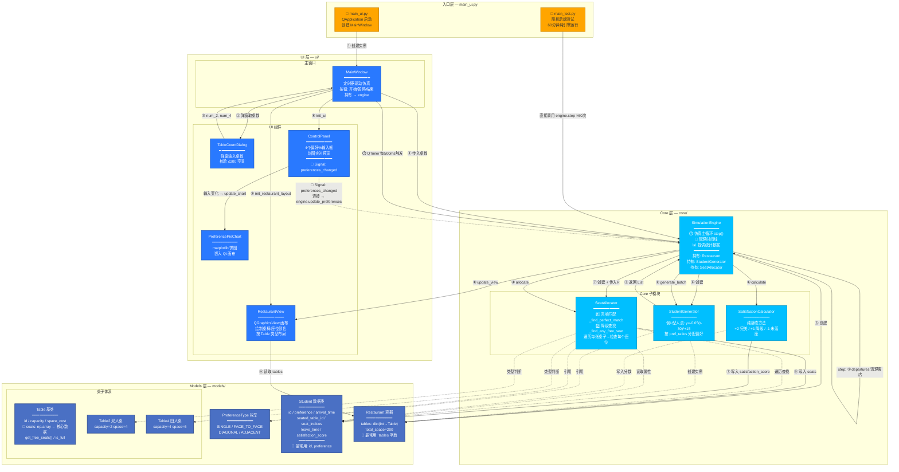

# 图1a：项目总览 — 分层架构图

---

## 关键数据流总结

| 阶段 | 流向 | 传递内容 |
|------|------|----------|
| 启动 | UI → Core | `num_tables_2: int`, `num_tables_4: int` |
| 运行时配置 | ControlPanel → SimulationEngine | `pref_ratios: Dict[PreferenceType, float]` (通过 Qt Signal) |
| 每tick:生成 | SimulationEngine → StudentGenerator | `current_time: int`, `pref_ratios: dict` |
| 每tick:生成 | StudentGenerator → SimulationEngine | `List[Student]` |
| 每tick:分配 | SimulationEngine → SeatAllocator | `Student` 对象 |
| 每tick:分配 | SeatAllocator → Restaurant | 写入 `table.seats[i] = student.id` |
| 每tick:满意度 | SimulationEngine → SatisfactionCalculator | `Student` 对象 + `is_perfect_match: bool` |
| 每tick:渲染 | MainWindow → RestaurantView | `Restaurant` 对象 (只读 tables) |
| 结束 | SimulationEngine → MainWindow | `get_statistics(): dict` |

## 核心接口一览

| 接口 | 类型 | 描述 |
|------|------|------|
| `SimulationEngine(pref_ratios) ← ControlPanel` | Qt Signal/Slot | 唯一运行时用户输入通道 |
| `SimulationEngine.step()` | 方法调用 | 每 tick 的主入口 |
| `SimulationEngine.get_statistics()` | 方法调用 | 获取当前统计数据 |
| `SeatAllocator.allocate(student) → bool` | 方法调用 | 座位分配核心接口 |
| `StudentGenerator.generate_batch(time, ratios) → List[Student]` | 方法调用 | 学生生成接口 |
| `RestaurantView.update_view(restaurant)` | 方法调用 | 视图刷新接口 |
