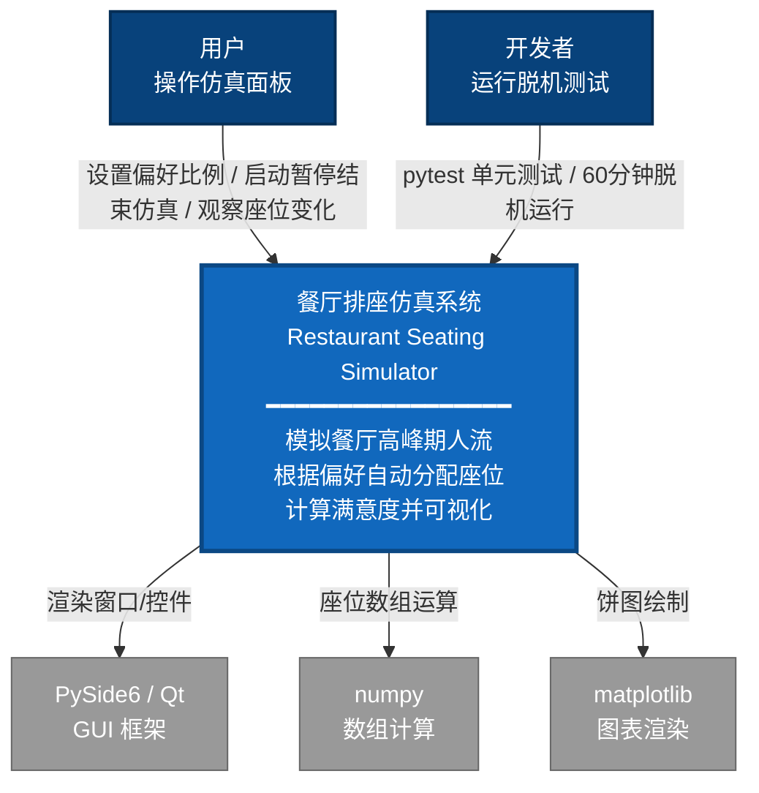
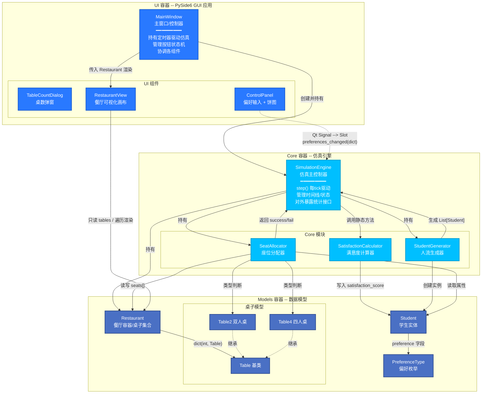
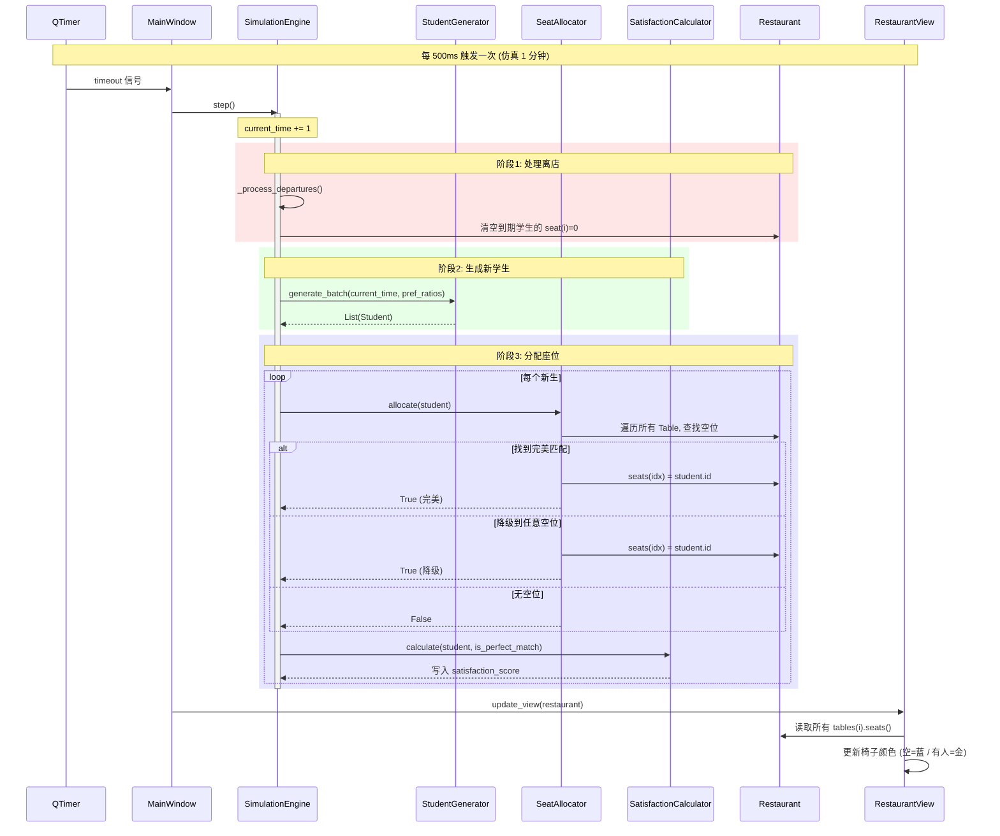

# 图1b：项目总览 — C4 风格容器图

## C4 Level 1：系统上下文图 (System Context)



---

## C4 Level 2：容器图 (Container Diagram)



---

## C4 Level 3：组件交互时序 (关键 Tick 流程)



---

## 容器间接口契约

| 调用方 | 被调用方 | 接口 | 数据方向 |
|--------|----------|------|----------|
| MainWindow | SimulationEngine | `engine.step()` | 无参数 |
| MainWindow | SimulationEngine | `engine.reset(n2, n4)` | UI --> Core (int*2) |
| MainWindow | SimulationEngine | `engine.get_statistics() --> dict` | Core --> UI |
| ControlPanel | SimulationEngine | `preferences_changed.emit(dict)` | UI --> Core (Qt Signal) |
| SimulationEngine | StudentGenerator | `generate_batch(time, ratios) --> List(Student)` | Core 内部 |
| SimulationEngine | SeatAllocator | `allocate(student) --> bool` | Core 内部 |
| SimulationEngine | SatisfactionCalculator | `calculate_and_assign(student, bool)` | Core 内部 (静态) |
| MainWindow | RestaurantView | `update_view(restaurant)` | UI 内部 |
| RestaurantView | Restaurant | 读取 `tables(id).seats()` | UI --> Models (只读) |
```

