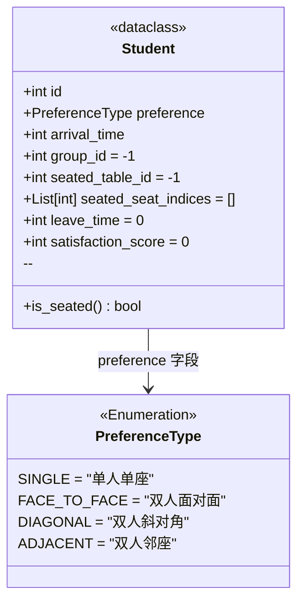

# models/student.py -- 学生实体与偏好枚举

## 类图总览



---

## 数据成员使用频率

| 成员 | 使用频率 | 主要使用场景 |
|------|----------|-------------|
| `id` | 极高 | 座位分配时写入 seats 数组作为占用标记；视图渲染时读取判断空/有人 |
| `preference` | 极高 | 座位分配时按偏好匹配座位类型；学生生成时按比例随机选择 |
| `leave_time` | 高 | 离店处理时判断是否到点离开 |
| `seated_table_id` | 高 | 分配时记录落座桌子；离店时释放对应桌子的座位 |
| `satisfaction_score` | 高 | 满意度计算时写入得分；仿真统计时汇总 |
| `arrival_time` | 高 | 学生生成时记录到达时刻 |
| `seated_seat_indices` | 中 | 分配时记录具体座位索引；离店时清空 |
| `group_id` | 极低 | 预留字段，代码中始终为默认值 -1，未使用 |

---

## 函数说明

**`is_seated` (property)** -- 判断 `seated_table_id != -1`，一行逻辑。被离店处理和满意度计算依赖，用于区分"已落座"和"未落座"两种状态。

**设计要点：**
- `Student` 是 `@dataclass`，自动生成 `__init__` / `__repr__` / `__eq__`
- `seated_seat_indices` 使用 `field(default_factory=list)` 避免 Python 列表共享陷阱
- `group_id` 预留未用，注释标注"留作后期拓展"
```

