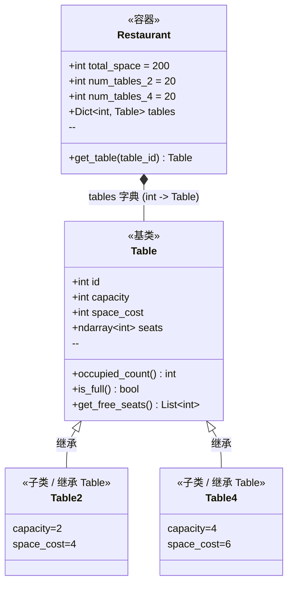

# models/restaurant.py -- 桌子体系与餐厅容器

## 类图总览



---

## 核心数据结构：`Table.seats` (numpy 数组)

```
seats = np.zeros(capacity, dtype=int)

示例 (四人桌，第0和第2座有人):
        索引0    索引1    索引2    索引3
         |        |        |        |
seats = [ 101  ,   0   ,   102  ,   0   ]
          |              |
      student.id=101   student.id=102
      
0 = 空位，非0 = 该座位的 Student.id
```

这是**整个系统最核心的数据结构**：SeatAllocator 写入值、SimulationEngine 清空值、RestaurantView 读取渲染。

---

## 数据成员使用频率

| 成员 | 使用频率 | 主要使用场景 |
|------|----------|-------------|
| `Table.seats` | 极高 | 分配时写入/读取判断空位；离店时清空；视图渲染时遍历着色 |
| `Restaurant.tables` | 极高 | SeatAllocator 遍历查找空位；RestaurantView 遍历绘制 |
| `Table.get_free_seats()` | 极高 | 每次座位查找都调用，遍历 seats 返回所有值为0的索引 |
| `Table.capacity` | 高 | 判断桌子类型(2人/4人)；SINGLE 偏好匹配全空桌 |
| `Table.is_full` | 高 | 分配时快速跳过满桌 |
| `Table.space_cost` | 中 | 空间校验，构造 Restaurant 时检查 |
| `Table.occupied_count` | 中 | 统计信息，利用 `np.count_nonzero` 向量化计算 |

---

## 函数说明

- **`get_free_seats()`** -- 遍历 seats，收集值为 0 的索引返回。最频繁调用的方法。
- **`occupied_count` / `is_full`** -- 基于 `np.count_nonzero(seats)` 的 property，一行逻辑。
- **`Restaurant.__init__`** -- 先校验空间(n2*4 + n4*6 <= 200)，再循环创建 Table2/Table4 对象，ID 从 1 递增。

**继承关系**：`Table2(capacity=2, space=4)` 和 `Table4(capacity=4, space=6)` 仅通过 `super().__init__` 传入不同参数，无额外逻辑。
```

