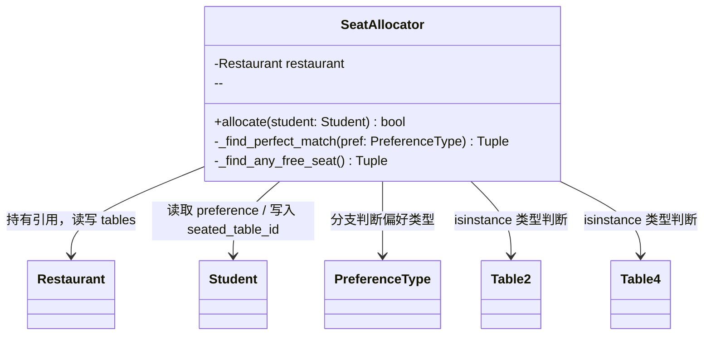
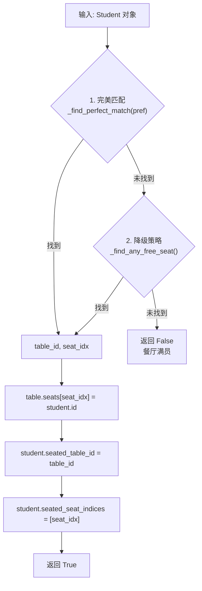
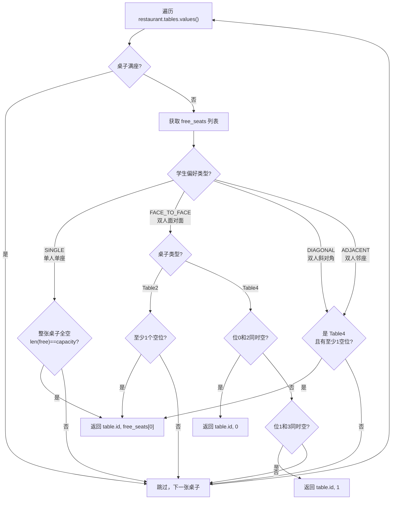
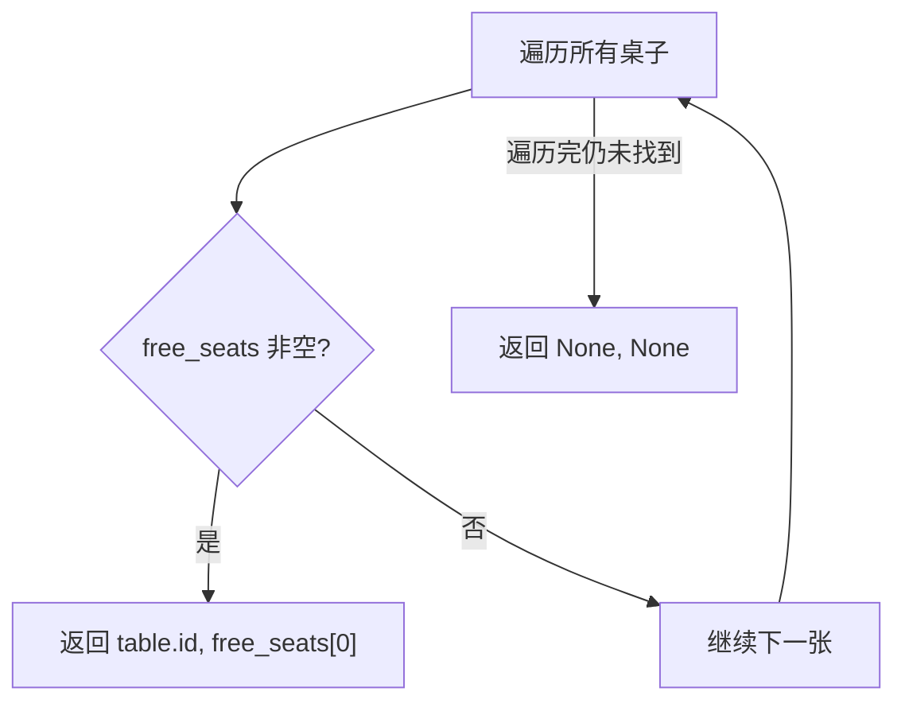

# core/seat_allocator.py -- 座位分配器

## 类图总览



---

## `allocate()` -- 主入口（两阶段策略）



---

## `_find_perfect_match()` -- 详细匹配逻辑



### 匹配规则速查表

| 偏好 | Table2 | Table4 |
|------|--------|--------|
| SINGLE | 找完全空桌 | 找完全空桌 |
| FACE_TO_FACE | 任意空位即可 | 找对面空位 (0--2, 1--3) |
| DIAGONAL | -- | 任意空位 (未精确检查斜对角) |
| ADJACENT | -- | 任意空位 (未精确检查邻座) |

---

## `_find_any_free_seat()` -- 降级策略



找第一个有空位的桌子，返回第一个空位。不检测偏好。

---

## 算法复杂度

| 操作 | 时间复杂度 | 说明 |
|------|-----------|------|
| 完美匹配 | O(T*C) | T=桌子数(默认40), C=容量(2/4), 约160次检查 |
| 降级查找 | O(T*C) | 最坏情况两次全遍历，约320次数组访问/tick |

## 已知限制

- **DIAGONAL / ADJACENT 未精确匹配**：代码注释标注"不具体检查"，只检查 Table4 有任意空位即返回，未验证斜对角/邻座条件
- **SINGLE 偏好只在全空桌匹配**：不分配给已有部分占用的桌子
```

