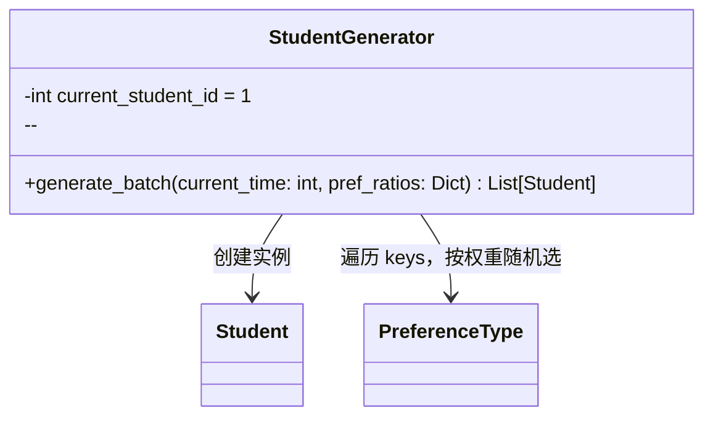
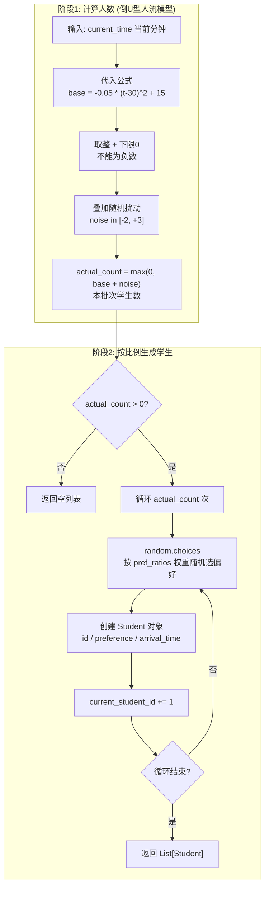

# core/student_generator.py -- 学生生成器

## 类图总览



---

## `generate_batch()` -- 完整流程



---

## 倒U型人流曲线

```
人数
 ^
16|        *  *
14|      *      *
12|    *          *
10|   *            *
 8|  *              *
 6| *                *
 4|*                  *
 2|*                    *
 0+------------------------------> 时间(分钟)
   0   10   20   30   40   50   60

峰值在 t=30 分钟:
base = -0.05 * 0 + 15 = 15 人/分钟
随机扰动后: 13~18 人/分钟

t=0 时: base = -45 + 15 = -30 --> 截断为 0
t=60时: base = -45 + 15 = -30 --> 截断为 0
```

---

## 偏好分配机制

使用 Python `random.choices` 的加权随机选择。UI 层通过 `pref_ratios` 字典（如 `{SINGLE: 0.25, FACE_TO_FACE: 0.25, ...}`）动态控制各偏好比例，每次生成时按权重随机分配。

| 参数 | 值 |
|------|-----|
| 人流模型 | 二次函数: `y = -0.05*(t-30)^2 + 15` |
| 高峰期 | t=30 分钟 (约 15 人/分钟) |
| 随机扰动 | `random.randint(-2, 3)` |
| 最小值 | `max(0, ...)` 确保人数不为负 |
| 学生ID | 全局自增，从 1 开始，跨批次连续 |
```

