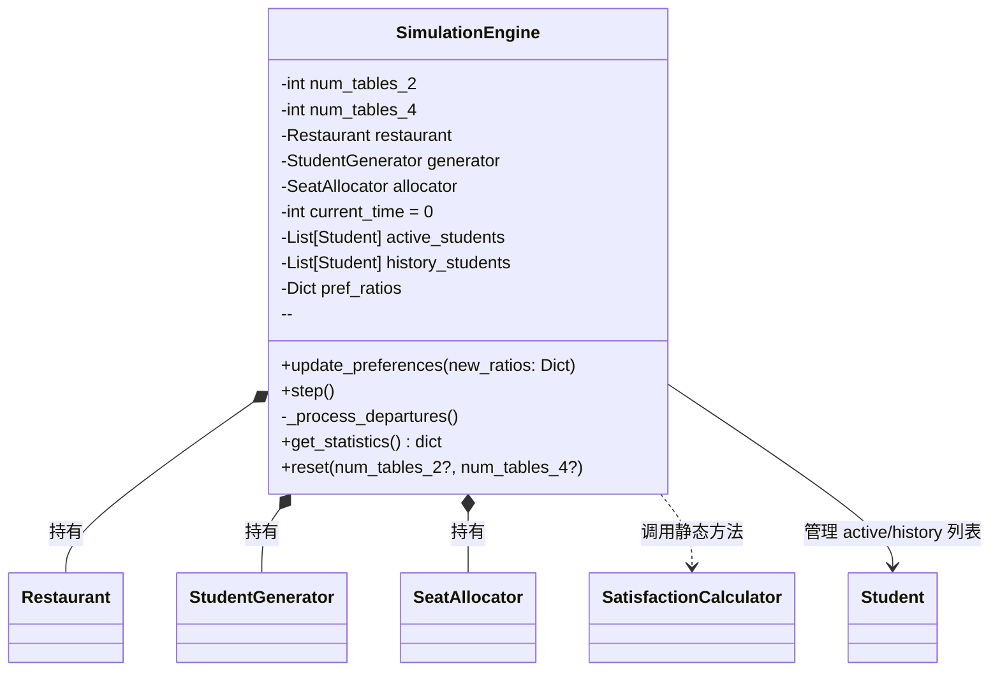
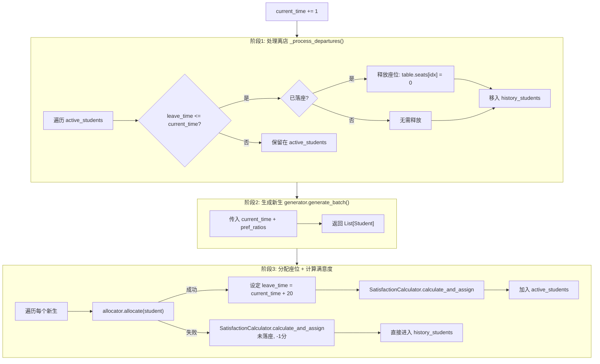
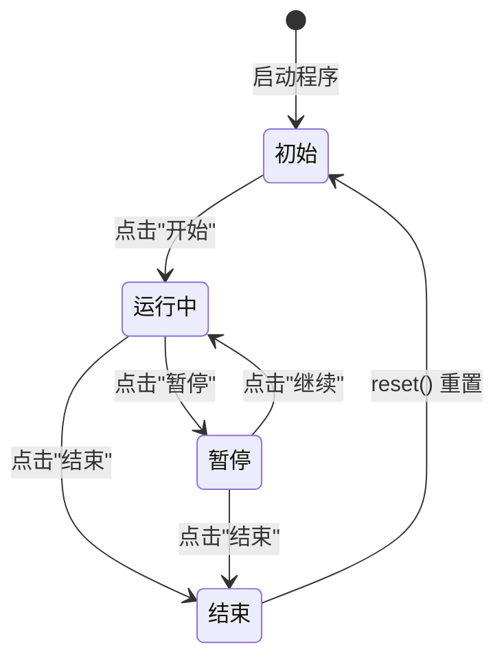

# core/simulation.py -- 仿真引擎（核心调度器）

## 类图总览



---

## 数据成员使用频率

| 成员 | 使用频率 | 说明 |
|------|----------|------|
| `restaurant` | 极高 | 每 tick 分配座位、释放座位、渲染视图都依赖它 |
| `active_students` | 极高 | 每 tick 遍历处理离店、追加新生 |
| `current_time` | 极高 | 每 tick +1，驱动人流曲线和离店判断 |
| `allocator` | 高 | 每 tick 为每个新生调用 allocate |
| `generator` | 高 | 每 tick 调用一次生成批次 |
| `history_students` | 高 | 离店学生归档，统计满意度时遍历 |
| `pref_ratios` | 中 | UI 更新时写入，生成学生时读取 |
| `num_tables_2/4` | 低 | 初始化/reset 时使用 |

---

## `step()` -- 每 Tick 主循环



---

## `_process_departures()` -- 离店处理

遍历 active_students，对 `leave_time <= current_time` 的学生：若已落座则遍历 seated_seat_indices 将对应 `seats[i]` 清零，然后移入 history_students。未到点的保留。

---

## `reset()` -- 完全重置

按可选新桌数重建 Restaurant / StudentGenerator / SeatAllocator，清零 current_time 和两个学生列表，pref_ratios 恢复默认各 25%。

---

## 关键时序参数

| 参数 | 值 | 说明 |
|------|-----|------|
| 就餐时间 | 固定 20 分钟 | `leave_time = arrival_time + 20` |
| 定时器间隔 | 500ms(实际) = 1分钟(仿真) | 由 MainWindow 的 QTimer 控制 |
| 总仿真时长 | 由用户控制 | 点击"结束"停止 |

## 状态机


```

