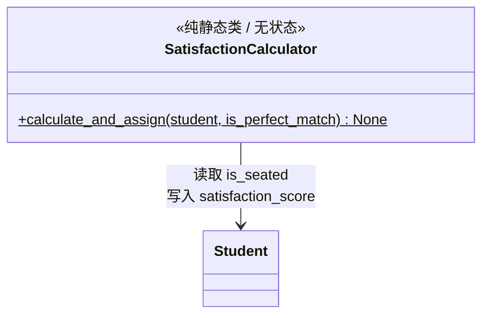

# core/satisfaction.py -- 满意度计算器

## 类图总览



---

## 计分规则

`calculate_and_assign(student, is_perfect_match)` 是纯静态方法，三分支判定：

| 情况 | 得分 | 判定条件 |
|------|------|----------|
| 完美落座 | +2 | `is_seated == True` AND `is_perfect_match == True` |
| 降级落座 | +1 | `is_seated == True` AND `is_perfect_match == False` |
| 未能落座 | -1 | `is_seated == False` (餐厅满员) |

直接修改传入的 Student 对象的 `satisfaction_score` 字段，不返回值。

---

## 已知问题

当前 `SimulationEngine.step()` 中始终传 `is_perfect_match=False`：

```python
# 成功落座
SatisfactionCalculator.calculate_and_assign(student, is_perfect_match=False)
# 落座失败
SatisfactionCalculator.calculate_and_assign(student, is_perfect_match=False)
```

导致 **+2 分支永远不会触发**。需要 SeatAllocator 返回匹配质量信息才能修复。

---

## 设计特点

- **无状态**：纯静态方法，不持有任何数据
- **极简**：仅 13 行有效代码，单文件最小模块
- **依赖**：仅依赖 `Student` 的 `is_seated` 属性和 `satisfaction_score` 字段
```

