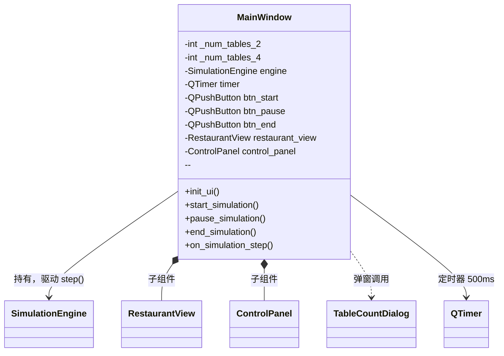
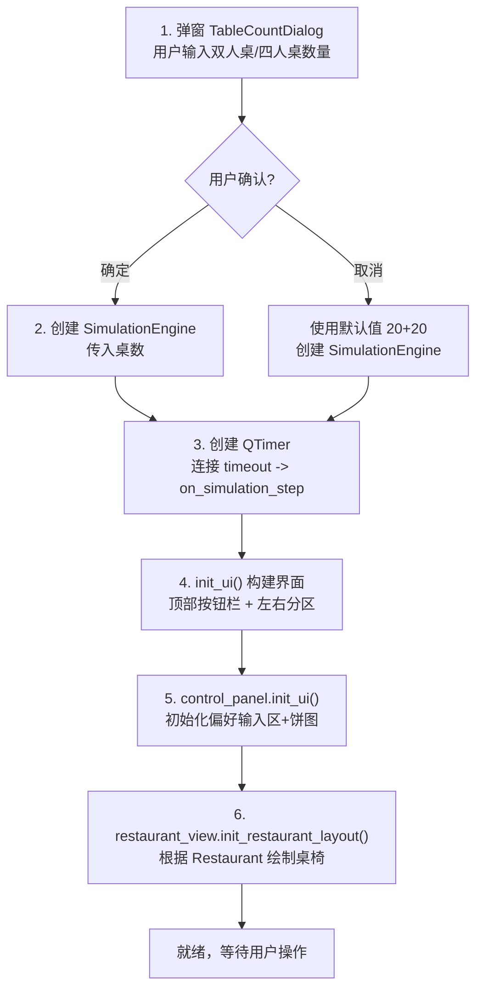
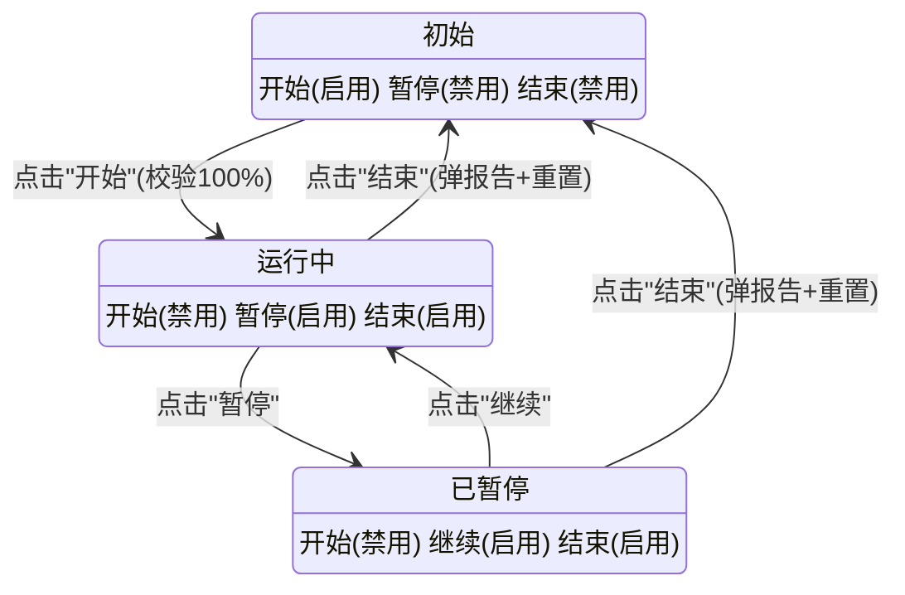

# ui/main_window.py -- 主窗口（UI 总控制器）

## 类图总览



---

## 启动流程



---

## `start_simulation()` -- 开始仿真

校验偏好总和是否=100%，通过后禁用输入框、切换按钮状态、启动 QTimer（500ms 间隔）。

## `pause_simulation()` -- 暂停/继续

判断 `timer.isActive()`：运行中则 stop 并改按钮文字为"继续"；已暂停则 start 并恢复文字为"暂停"。

## `end_simulation()` -- 结束仿真

停止定时器 -> 调用 `engine.get_statistics()` 弹出报告 -> 弹窗询问新桌数 -> `engine.reset()` -> 刷新餐厅视图 -> 恢复按钮和输入框初始状态。

## `on_simulation_step()` -- 定时器回调

每 500ms 触发：`engine.step()` 推进 1 分钟仿真 -> `restaurant_view.update_view()` 刷新座位颜色。

---

## 按钮状态机



---

## 信号/槽连接一览

| 信号源 | 信号 | 槽函数 | 触发时机 |
|--------|------|--------|----------|
| `btn_start` | `clicked` | `start_simulation` | 用户点击"开始" |
| `btn_pause` | `clicked` | `pause_simulation` | 用户点击"暂停/继续" |
| `btn_end` | `clicked` | `end_simulation` | 用户点击"结束" |
| `QTimer` | `timeout` | `on_simulation_step` | 每 500ms 自动 |
| `ControlPanel` | `preferences_changed(dict)` | `engine.update_preferences` | 偏好总和=100%时 |

**注意**: `preferences_changed -> engine.update_preferences` 是 UI 与 Core 之间唯一的运行时数据通道（Qt Signal/Slot 机制）。
```

