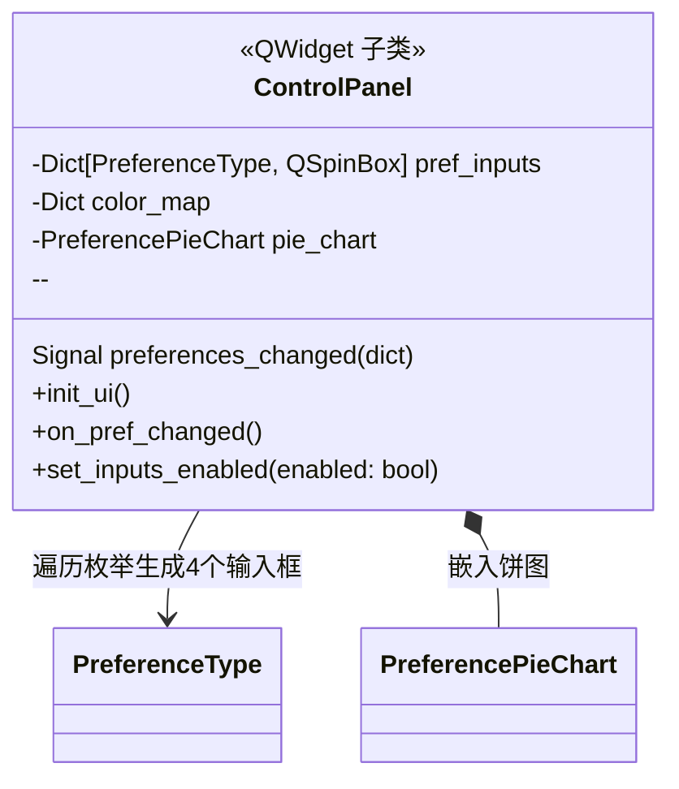
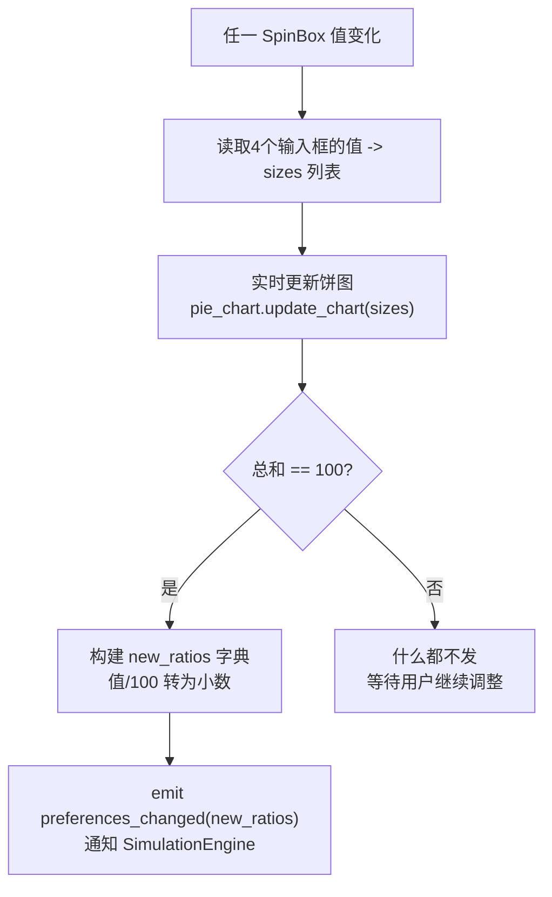

# ui/control_panel.py -- 右侧操控面板

## 类图总览



---

## `init_ui()` -- 构建 4 个偏好输入卡片

遍历 `PreferenceType` 枚举，为每种偏好创建一个带背景色的 Frame 卡片（含 QLabel 标签 + QSpinBox 0-100 输入框，默认 25），连接 `valueChanged` 信号到 `on_pref_changed`。最后嵌入 PreferencePieChart 饼图组件。

**颜色映射：**

| 偏好 | 颜色 | 色值 |
|------|------|------|
| SINGLE 单人 | 蓝色 | `#00BFFF` |
| FACE_TO_FACE 面对面 | 粉红 | `#FF6B6B` |
| DIAGONAL 斜对角 | 绿色 | `#8FBC8F` |
| ADJACENT 邻座 | 橙色 | `#FFA500` |

---

## `on_pref_changed()` -- 值变化处理



**关键设计**：只有总和恰好为 100% 时才发射信号。

---

## `set_inputs_enabled()`

遍历 `pref_inputs` 字典，逐个 `setEnabled(enabled)`。仿真启动后禁用所有输入框，结束时重新启用，防止中途改参数导致数据不一致。
```

