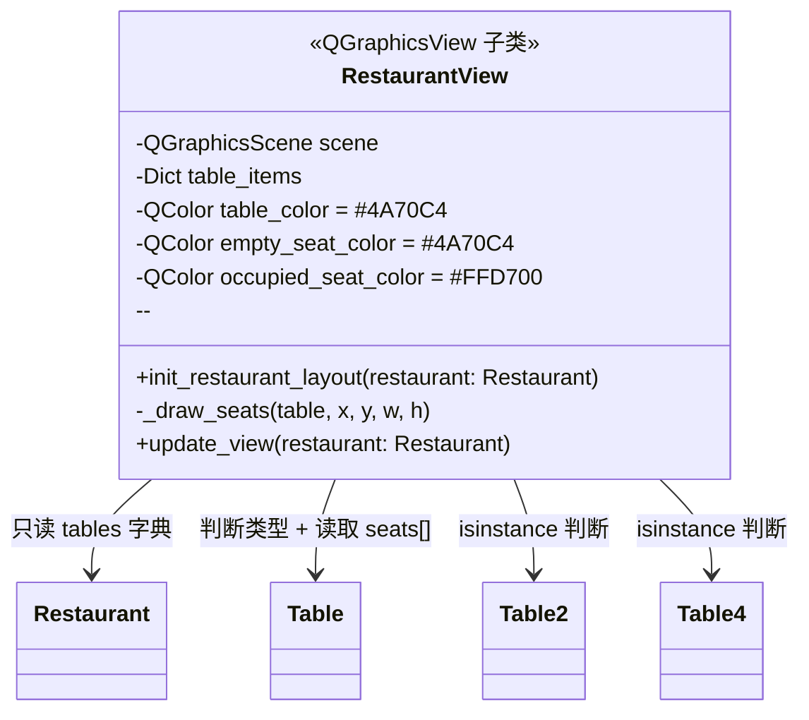
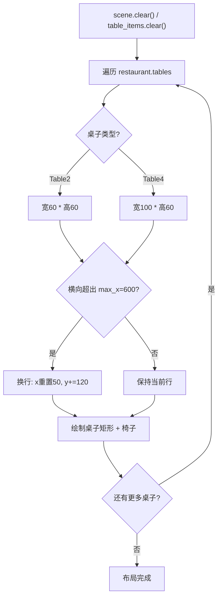

# ui/restaurant_view.py -- 餐厅可视化视图

## 类图总览



---

## `init_restaurant_layout()` -- 完整绘制流程



## `_draw_seats()` -- 椅子坐标计算

- **Table2**：上下各 1 个座位（居中）
- **Table4**：上下各 2 个座位（左右分布）
- 每个座位为 `QGraphicsEllipseItem`（半径 12px），初始蓝色
- 存入 `table_items[table_id]['seats']` 列表

## `update_view()` -- 逐帧刷新

遍历 `restaurant.tables`，对比 `table.seats[i]` 的值：非 0 则设对应椅子为金色 `#FFD700`，为 0 则恢复蓝色 `#4A70C4`。不做全量重绘，只更新颜色，每 500ms 执行一次。

---

## table_items 数据结构

```python
table_items = {
    1: {                             # table_id
        'rect': QGraphicsRectItem,   # 桌子矩形图形对象
        'seats': [                   # 椅子椭圆列表 (按 capacity)
            QGraphicsEllipseItem,    # 座位0
            QGraphicsEllipseItem,    # 座位1
            ...
        ]
    },
    2: { ... },
}
```

这是 Model 与 View 之间的缓存桥接：`Restaurant.tables[id].seats[]` 存数据 -> `table_items[id]['seats'][]` 存图形对象。
```

