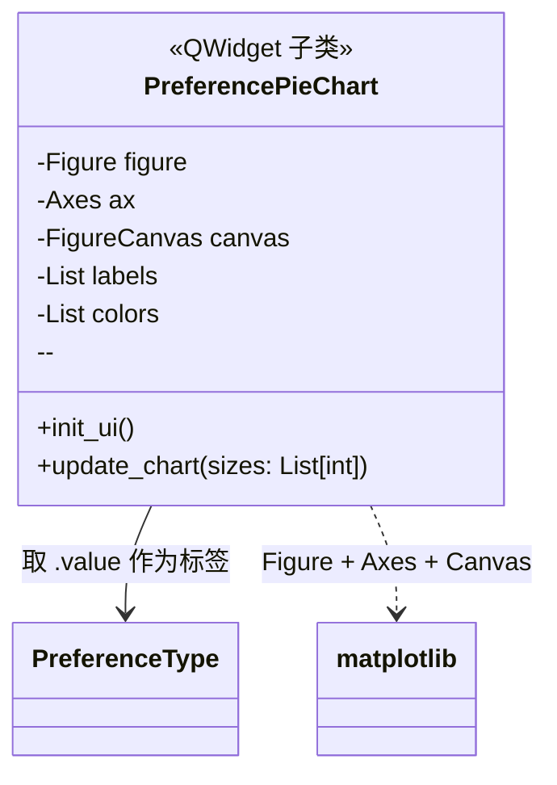

# ui/charts.py -- 偏好比例饼图

## 类图总览



---

## 工作原理

1. **`init_ui()`** -- `plt.subplots(figsize=(3,3))` 创建 matplotlib 画布，`FigureCanvas` 包装为 Qt 控件。从 `PreferenceType` 提取中文标签，定义 4 色配色。调用 `update_chart([25,25,25,25])` 渲染默认饼图。
2. **`update_chart(sizes)`** -- 清空 -> `ax.pie()` 绘制 -> `tight_layout()` 防溢出 -> `canvas.draw()` 刷新。被 `ControlPanel.on_pref_changed()` 实时调用。

## 样式配置速查

| 配置项 | 值 | 说明 |
|--------|-----|------|
| 画布尺寸 | 3*3 英寸 | 小巧，嵌入右侧面板 |
| 背景 | 透明 | 匹配 UI 灰色背景 |
| 扇区边框 | 白色 2px | 扇区之间清晰分隔 |
| 字体 | 8号加粗 | 标签和百分比文字 |
| 中文字体 | Microsoft YaHei -> SimHei -> Arial Unicode MS | 3级回退 |

## 依赖关系

- **上游**：`ControlPanel` 调用 `update_chart()`
- **下游**：`matplotlib` + `backend_qtagg.FigureCanvasQTAgg` 桥接 Qt
- **数据源**：`PreferenceType` 枚举提供标签文本（中文）
```

