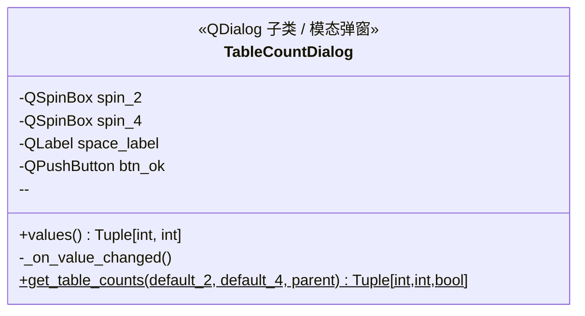

# ui/table_count_dialog.py -- 桌子数量设置弹窗

## 类图总览



---

## `get_table_counts()` -- 静态工厂方法（唯一对外接口）

创建对话框实例 -> `dlg.exec()` 模态阻塞 -> 用户点"确定"返回 `(n2, n4, True)`，点"取消"返回 `(default, default, False)`。

被两个场景调用：
- 程序启动时 `MainWindow.__init__`（默认值 20, 20）
- 仿真结束重置时 `MainWindow.end_simulation`（默认值为上次使用的值）

## `_on_value_changed()` -- 实时空间校验

计算 `used = n2*4 + n4*6`，若 <= 200 则启用"确定"按钮并绿色显示；超限则禁用按钮并红色警告。

## 约束规则

| 参数 | 范围 | 空间占用 | 最大数量 |
|------|------|----------|----------|
| 双人桌 | 0 ~ 50 | 4 单位/张 | 50 (50*4=200) |
| 四人桌 | 0 ~ 33 | 6 单位/张 | 33 (33*6=198) |
| 总空间 | <= 200 单位 | -- | 默认: 20*4 + 20*6 = 200 |
```

