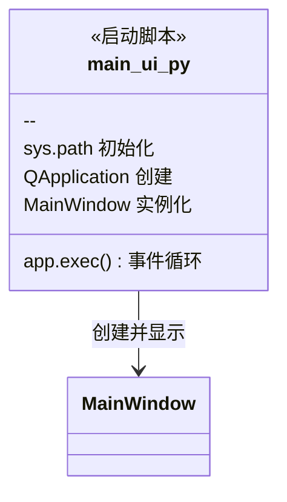
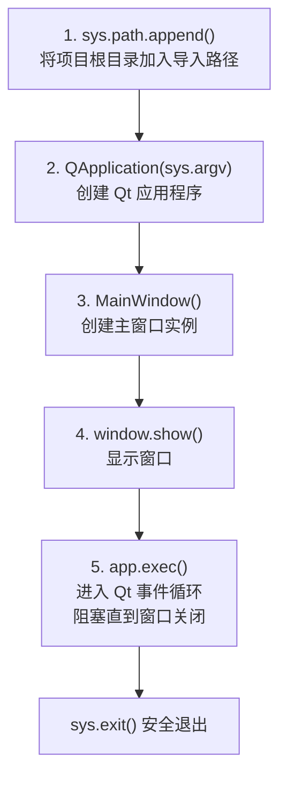
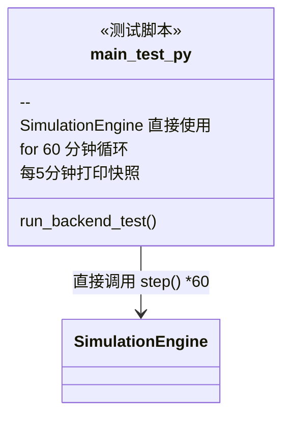
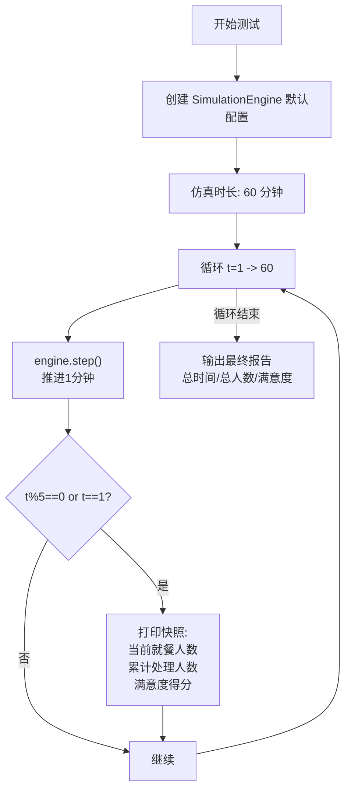
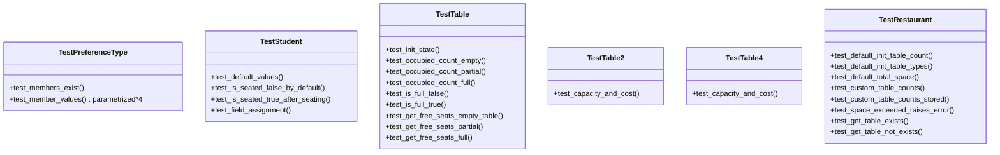
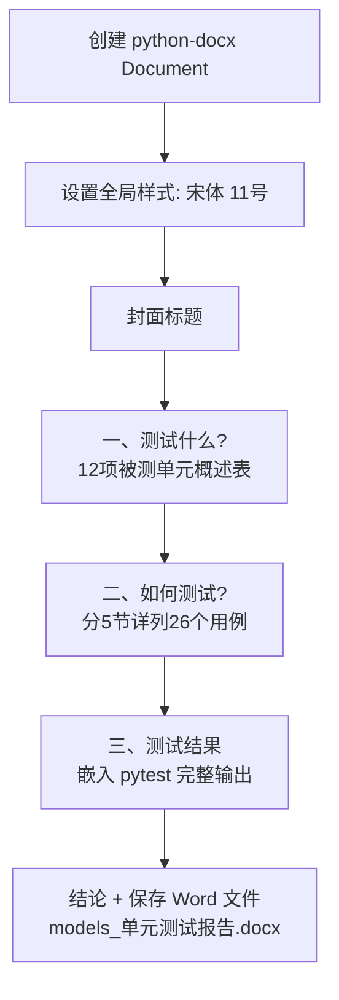
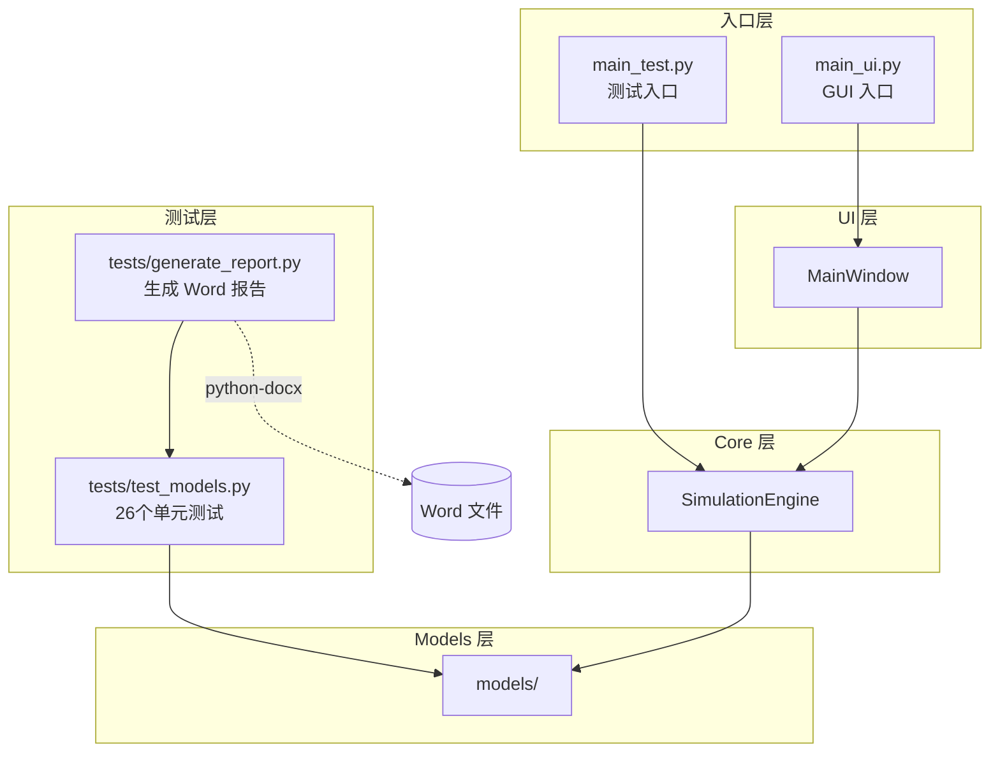

# 入口文件与测试文件

---

## main_ui.py -- 程序入口



### 启动流程



核心就 6 行代码，典型的 PySide6 最小启动模板。

---

## main_test.py -- 后台脱机测试



### 测试流程



无 GUI 依赖，纯控制台输出，用于验证后端逻辑是否正常。

---

## tests/test_models.py -- models 单元测试



### 测试覆盖统计

| 测试类 | 测试函数数 | 覆盖目标 |
|--------|-----------|----------|
| TestPreferenceType | 1 + 4参数化 | 枚举完整性 + .value 值 |
| TestStudent | 4 | 默认值 + is_seated 属性 + 字段读写 |
| TestTable | 8 | 初始化 + occupied_count/is_full/get_free_seats 各3种状态 |
| TestTable2 | 1 | capacity + space_cost |
| TestTable4 | 1 | capacity + space_cost |
| TestRestaurant | 7 | 初始化 + 空间校验 + get_table |
| **合计** | **26** | **全部通过 (0.14s)** |

---

## tests/generate_report.py -- 测试报告生成器



依赖 `python-docx` 库，将 pytest 输出格式化为 Word 文档。

---

## 文件依赖关系总图



**关键观察**：`main_test.py` 和 `main_ui.py` 都依赖 `SimulationEngine`，但走不同路径：
- GUI 路线：`main_ui.py -> MainWindow -> QTimer -> SimulationEngine.step()`
- 测试路线：`main_test.py -> for 循环 -> SimulationEngine.step()` 直接调用
```

